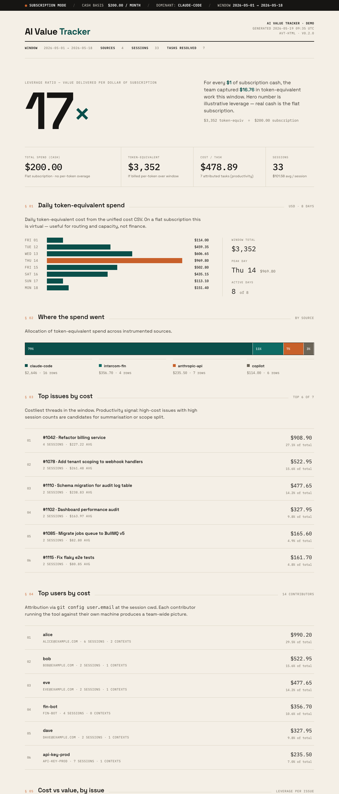

<div align="center">

# 📊 AI Value Tracker

**Turn your AI spend into a story you can defend.**

[](https://www.python.org/)
[](LICENSE)
[](#)

*Cost in. Value out. Ratio over time. Per feature, per user, per team.*

</div>

---

## The pitch

Anyone can run `claude /cost`. Few can answer "and what did it produce?"

This tool joins every dollar of AI spend (Claude Code, the Anthropic API, GitHub Copilot, any vendor with a CSV) to the work it actually generated (issues, PRs, lines, eventually product telemetry) and renders the answer as a single editorial HTML report — the kind of one-pager you can put in a Monday email to leadership.

If your team is on a flat subscription, it tells you the leverage ratio: **"$200 cash bought $8,016 of token-equivalent work this week — that's 40× leverage."** If you're paying per token, it tells you which features are eating the bill.



---

## ⚡ 90-second tour

```bash
git clone https://github.com/ao92265/ai-value-tracker
cd ai-value-tracker && make install
source .venv/bin/activate

# Render the report against the bundled demo data
avt-html --cost examples/demo-cost.csv \
         --report examples/demo-report.csv \
         --cost-mode subscription --sub-cash 200 \
         --out out/report.html
open out/report.html
```

That's the whole pitch. Real numbers come next.

---

## Use it on your own data

```bash
# Cost side — walks every Claude Code session you've ever run
avt-cost --claude --days 30 --cost-mode subscription --sub-cash 200 \
         --out out/cost.csv

# Value side — pulls PR stats from any GitHub repo you point it at
export AVT_REPO=owner/name
avt-value --days 30 --out out/value.csv

# Join + render
avt-report --spend out/cost.csv --value out/value.csv \
           --out out/joined.csv
avt-html  --cost out/cost.csv --report out/joined.csv \
          --cost-mode subscription --sub-cash 200 \
          --out out/report.html
```

Or weekly via cron:

```bash
0 9 * * 1  $HOME/Repos/ai-value-tracker/bin/avt-weekly >> /tmp/avt-weekly.log 2>&1
```

---

## What the report actually shows

The editorial layout (Space Grotesk on paper-tone, terra & teal accents — no enterprise-SaaS slate) puts the hero number where leadership needs it and lets the long tail trail underneath.

| Section | What it answers |
|---|---|
| **Hero** | Leverage ratio (`137×`) in subscription mode, or total spend in API mode. |
| **Ribbon + KPIs** | Cash basis · token-equivalent · cost per task · session volume. Productivity is a first-class metric. |
| **§ 01 Daily spend** | Horizontal bars with peak-day highlight. 7 to 14 days. |
| **§ 02 Where the spend went** | Single allocation bar across every vendor source you've enabled. |
| **§ 03 Top issues by cost** | Costliest tickets, with productivity hints (long threads = candidates for split). |
| **§ 04 Top users by cost** | Team breakdown from `git config user.email`. Each contributor runs the tool, the team picture composes itself. |
| **§ 05 Cost vs value** | Per-issue leverage. Placeholder formula until product telemetry lands. |
| **Method** | Explains every number so nobody can wave it away. |

Print-friendly. Single self-contained HTML. No JS, no build step, no external assets beyond Google Fonts.

---

## Cost sources

AI spend lives in more places than just Claude Code. `avt-cost` unifies them.

| Source | Adapter | Status |
|---|---|---|
| Claude Code (JSONL logs across **every project**) | `--claude` | ✅ |
| Anthropic API (console CSV export) | `--anthropic-csv <path>` | ✅ |
| GitHub Copilot (admin API, per seat) | `--copilot-org <org>` | ✅ |
| Generic vendor CSV (Cursor / Gong / Intercom Fin / OpenAI / anything) | `--vendor-csv <path> --vendor-source <name>` | ✅ |
| Azure billing AI resource group | `--azure-billing` | planned |
| OpenAI usage API direct | `--openai` | planned |

Run any combination in one shot:

```bash
avt-cost --claude --days 30 \
         --anthropic-csv anthropic-export.csv \
         --copilot-org your-org \
         --vendor-csv gong-bill.csv --vendor-source gong \
         --out out/cost.csv
```

Output is one unified CSV with a `source` column, plus a percentage breakdown on stderr.

---

## How it works

```
~/.claude/projects/**/*.jsonl   →  avt-cost  →  cost.csv
GitHub repo (gh CLI)            →  avt-value →  value.csv
                                                  ↓
                                  avt-report →  joined.csv
                                                  ↓
                                  avt-html   →  report.html
```

**Spend** walks every project under `~/.claude/projects/`, sums token usage per session, multiplies by pricing in `src/avt/spend.py`, attributes the session to a branch via git reflog timestamp matching, then to an issue via branch name or commit `#NNNN` references, then to a user via `git config user.email` at the session cwd.

**Value** reads any GitHub repo via `gh`, pulls every PR that references each issue, sums lines / files / merge state.

**Report** joins on issue number, computes `value_score`, writes CSV.

**HTML** renders the single-page editorial report from those CSVs.

---

## The subscription gotcha

If your team is on Claude Max, Claude Pro, or Copilot Business, the per-token numbers this tool prints are **hypothetical** — what the same work would cost on the API at list price. Actual cash is the subscription.

Run with the right mode:

```bash
avt-cost --claude --cost-mode subscription --sub-cash 200
```

You get:

```
HYPOTHETICAL COST MODE (subscription plan in use)

Total: $8,015.94 across 93 sessions

Hypothetical API-equivalent: $8,015.94
Real subscription cash:      $200.00
Leverage ratio:              40.08×
```

A 40× ratio says "stay on the sub." A 0.4× ratio says "switch to API." Either way the answer is in the report.

---

## Team-wide picture

Each contributor runs `avt-cost --claude` against their own machine. The tool tags every session with `git config user.email`, so when the CSVs are merged (centrally or in a shared bucket), the **§ 04 Top users by cost** panel composes itself.

No central agent. No telemetry endpoint. No log shipping. Just CSVs.

If you want a single team-wide rollup, point a shared CI job at a checkout that aggregates each contributor's exported CSV:

```bash
cat alice-cost.csv bob-cost.csv carol-cost.csv > team-cost.csv
avt-html --cost team-cost.csv --out team-report.html ...
```

---

## FAQ

### How is this different from `claude /cost` or `claude-observatory`?

`claude /cost` and [claude-observatory](https://github.com/ao92265/claude-observatory) cover the spend side superbly. AI Value Tracker adds:

1. **Cross-vendor unification.** Five vendor dashboards collapse into one CSV with a `source` column.
2. **Per-issue attribution.** Spend mapped to tickets via branch + commit refs.
3. **Per-user attribution.** Spend mapped to humans via `git config user.email`.
4. **Cost-vs-value join.** PR output joined to spend, ratio computed.
5. **Editorial HTML report.** Designed to be emailed to leadership, not poked at in a CLI.
6. **Subscription leverage mode.** Sub-vs-API decision with a real number.

If you want hook-level observability and waste-finding, use claude-observatory. If you want the report that answers "is the AI investment paying back," use this.

### What about VCS that isn't GitHub?

`avt-value` is the only GitHub-specific module today. The spend side runs on any project. Other VCS adapters are ~100 lines each. PRs welcome.

### Is `value_score` real?

Not yet. Today it's `lines + (merged_prs × 200)` — directional only. For absolute numbers, ship the product telemetry in [`docs/telemetry-spec.md`](docs/telemetry-spec.md), then swap the formula in `report.py`.

### Pricing accuracy?

Token prices in `src/avt/spend.py` are list rate as of late 2025. They drift. Update when needed. Enterprise volume discounts are not modelled.

### What this is NOT

- Not a billing system. Talks to vendor invoices, doesn't replace them.
- Not real-time. Daily/weekly batch.
- Not a finance system of record. Numbers in hypothetical mode aren't auditable.
- Not a hook tracer. Use claude-observatory for that.

---

## Configuration

| Env var | Default | Purpose |
|---|---|---|
| `AVT_PROJECT` | `~/.claude/projects` | Root directory to walk for JSONL sessions. |
| `AVT_REPO` | _(unset)_ | GitHub repo (`owner/name`) for `avt-value`. |
| `AVT_OUT` | `~/.claude/observatory-logs/avt` | Where `avt-weekly` snapshots land. |

---

## Layout

```
ai-value-tracker/
├── README.md
├── LICENSE
├── CONTRIBUTING.md
├── Makefile
├── pyproject.toml
├── bin/avt-weekly
├── docs/
│   ├── screenshot.png
│   └── telemetry-spec.md
├── examples/
│   ├── demo-cost.csv
│   ├── demo-report.csv
│   └── weekly-cron.sh
└── src/avt/
    ├── spend.py            JSONL → cost per session, branch, issue, user
    ├── value.py            gh → PRs, lines, files per issue
    ├── report.py           join + CSV
    ├── html_report.py      editorial HTML render
    ├── cost.py             unified multi-source cost
    ├── telemetry.py        product-side stub
    └── sources/
        ├── claude_jsonl.py
        ├── anthropic_invoice.py
        ├── copilot_admin.py
        └── vendor_csv.py
```

---

## License

MIT. Use it, fork it, ship it. Attribution welcome but not required.
